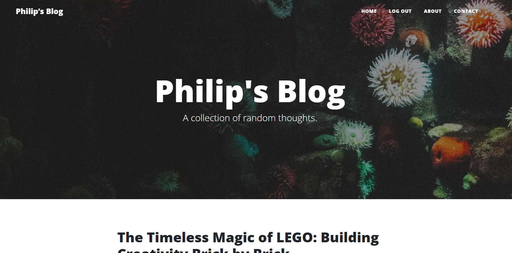

# Philip’s Blog

A personal blog website built **from scratch** using **Flask**, **Python**, **Bootstrap**, and **PostgreSQL** — deployed on [Render](https://render.com).



## ✨ Features
- 📝 **Full CRUD** for blog posts (create, read, update, delete)
- 🔑 **User authentication** (register, login, logout)
- 🖋️ **Rich text editing** with Flask-CKEditor
- 💬 **Comment system** linked to blog posts
- 👤 **Gravatar integration** for profile images
- 📱 **Mobile-friendly** Bootstrap layout
- 🔒 **Admin-only features** for managing posts

## 🛠️ Technologies Used
- Python 3
- Flask 2.3.2
- SQLAlchemy ORM
- PostgreSQL (Render)
- Flask-Login, Flask-WTF
- Flask-Bootstrap, Flask-Gravatar, Flask-CKEditor
- Gunicorn (production WSGI server)
- dotenv for environment variables

## 🚀 Deployment
Deployed on [Render](https://render.com) with:
- PostgreSQL database (free tier)
- Gunicorn server
- `.env` for sensitive credentials

## 📦 Installation

1. **Clone the repository**
   ```bash
   git clone https://github.com/YOUR-USERNAME/YOUR-REPO.git
   cd YOUR-REPO
2. Create a virtual environment
   
   python -m venv venv
   source venv/bin/activate   # macOS/Linux
   venv\Scripts\activate      # Windows
4. Install dependencies
   
   pip install -r requirements.txt
6. Set environment variables
   
   Create a .env file in the root directory:
   SECRET_KEY=your_secret_key
   DATABASE_URL=your_postgres_url
8. Run the app
   
   flask run
10. Open in browser
    
      http://127.0.0.1:5000
   
🌐 Live Demo

You can check out the deployed site here:
🔗 [Philip's Blog on Render](https://philips-blog-9kuj.onrender.com/)

📚 Lessons Learned

Resolving dependency conflicts (Flask, Jinja2, MarkupSafe)

Configuring PostgreSQL on Render

Using .env for security

Deploying Flask apps with Gunicorn

Keeping Render free-tier sites alive with UptimeRobot/cron-job.org

🧠 My Journey

This project started as part of my programming course, and it turned into my first fully deployed web app.
Some challenges I overcame:

Figuring out why my Python version wasn’t compatible on Render (fixed by setting an older version in .env)

Handling PostgreSQL database setup and migration

Debugging Render build logs with persistence and problem-solving

It might have taken months and lots of late nights, but hitting “live” for the first time was worth it.

Better Call Phil for your next Flask site. 😉


